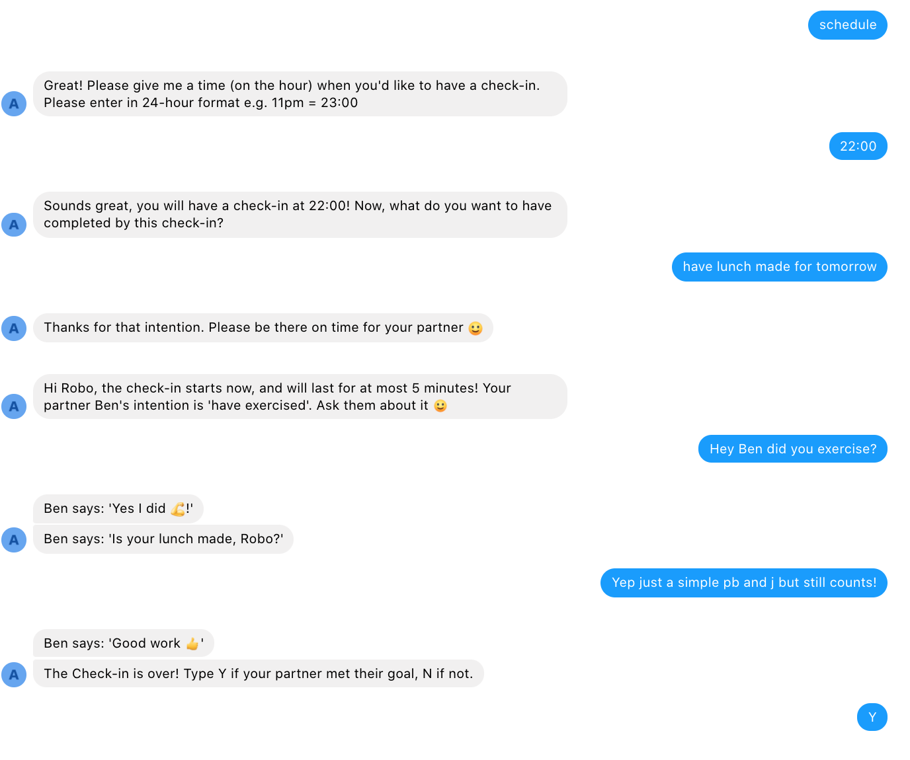

# Motivation
Our aim for you the user: Empower you to achieve your goals on time, and help another do the same.

# How it works
- Specify a check-in time
- Indicate your goal (i.e. what you hope to have completed by then).
- The bot will try to pair you with another user who has a check-in then. 
- If there's a match, the bot facilitates a conversation where you will check if the other user met their goal, and they will check if you met your goal. 
- After the session closes in 5 minutes, the bot will ask you whether your partner completed their goal, and will ask your partner whether you completed your goal.
- Note that if the bot does not find a match it will still ask you if you made your goal.

# Example

# Feedback

You can reach earlyapp2020 at gmail for any feedback or questions. We'd love to hear from you!
